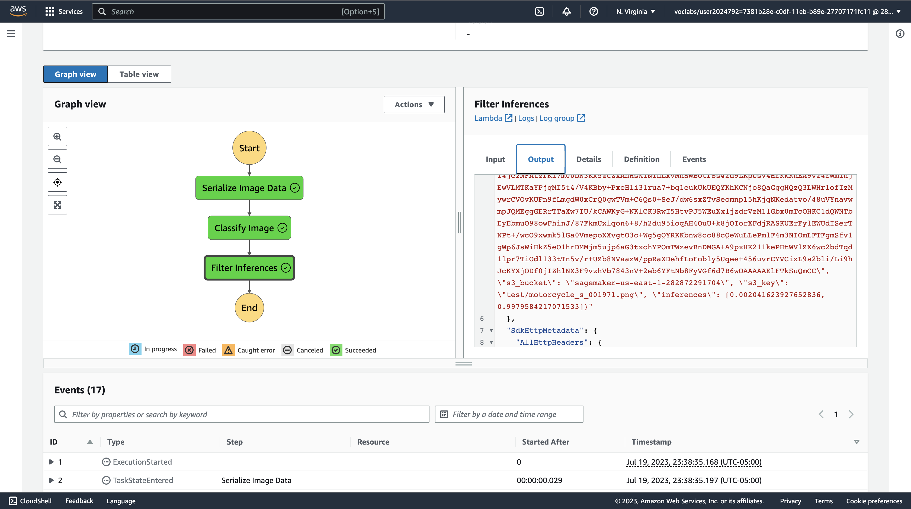
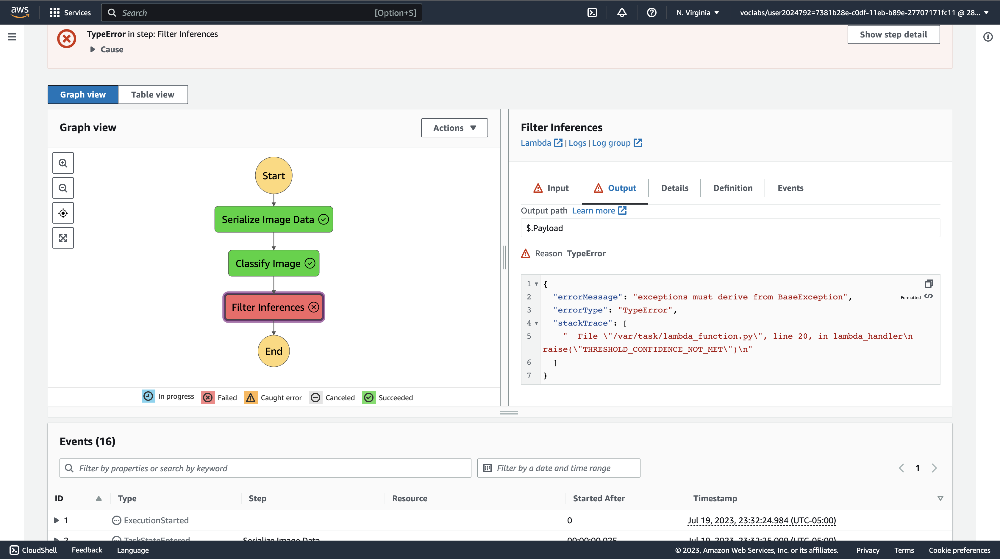
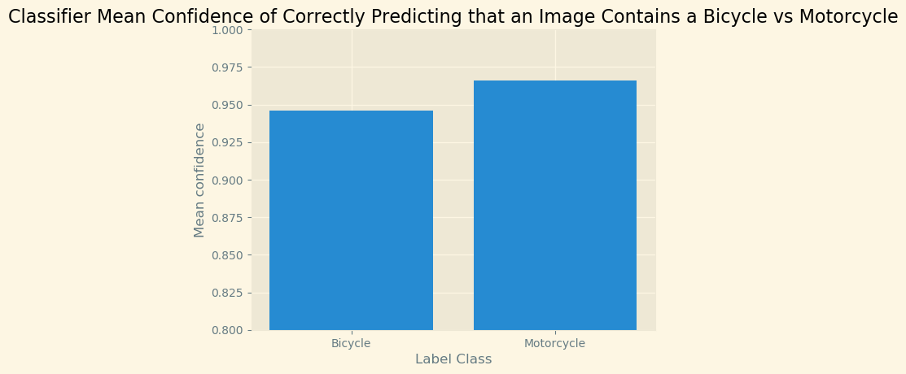

# Building a ML Workflow For Scones Unlimited On Amazon SageMaker

This project greatly improved my understanding of AWS Lambda functions, Step Functions, and the ML model development process. I especially enjoyed learning more about the ETL process and implementing the step function workflow.

## Screenshot of Step Function Executions

### Success Case

### Failure Case

The threshold used for filtering low confidence inferences was 0.8

## My Visualization

Shown above, I created a bar plot to compare the classifier's mean confidence of correctly predicting that an image contains a bicycle vs a motorcycle. The results suggest that the classifier more confidently correctly predicts that an image contains a motorcycle than a bicycle. As explained further in the notebook, the captured data only reflects the classifier executions that returned inferences above the confidence threshold, so the means displayed in the visualization may be above the true mean confidences.